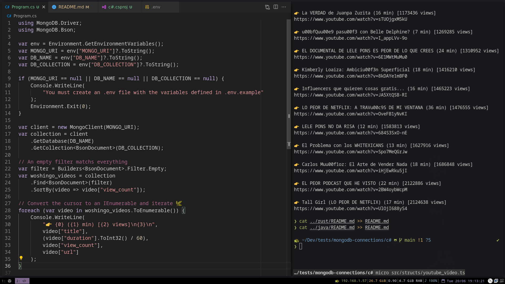

<!-- markdownlint-disable MD033 -->
# MongoDB with C\#


This repo shows how to connect to MongoDB using the official C# driver.

It was really awesome how quickly you can get things done with the `dotnet
cli`, C# has a nice ecosystem and high quality documentation. The API
didn't need any boilerplate to get started, however I'm wondering how
I should structure the project for a more complex application.

Resources used:

- Official C# driver documentation: <https://www.mongodb.com/docs/drivers/csharp/>
- C# quickstart for MongoDB: <https://www.mongodb.com/docs/drivers/csharp/current/quick-start/#std-label-csharp-quickstart>

---

## About the data

The `sample_woshingo` database queried here contains the complete list of
videos of the Mexican youtuber [Woshingo](https://www.youtube.com/@Woshingo), scrapped using [`yt-dlp`](https://github.com/yt-dlp/yt-dlp).

## About the code

All the project structure was autogenerated by running `dotnet new console`.

The MongoDB driver dependency is defined in the [c#.csproj](c%23.csproj)
file.

```xml
<ItemGroup>
    <PackageReference Include="MongoDB.Driver" Version="2.19.2" />
</ItemGroup>
```

The API is very straightforward and easy to use, here is basically all
the code needed to print a whole collection:

```csharp
# Create a new MongoClient
var client = new MongoClient(MONGO_URI);
var collection = client
    .GetDatabase(DB_NAME)
    .GetCollection<BsonDocument>(DB_COLLECTION);

// An empty filter matchs everything
var filter = Builders<BsonDocument>.Filter.Empty;
var woshingo_videos = collection
    .Find<BsonDocument>(filter)
    .SortBy(video => video["view_count"]);

// Convert the cursor to an IEnumerable and iterate 🌿
foreach (var video in woshingo_videos.ToEnumerable()) {
    Console.WriteLine(
        "👉 {0} ({1} min) [{2} views]\n{3}\n",
        video["title"],
        (video["duration"].ToInt32() / 60),
        video["view_count"],
        video["url"]
    );
}
```

## Running the code

First you will need a running MongoDB cluster. You can use a local instance or
preferably deploy a free tier cluster in the cloud using MongoDB Atlas.

We've used the [dotnet cli (sdk)](https://github.com/dotnet/sdk) as project
builder.

After cloning the repo, create a `.env` file with your connection string:

```sh
export MONGO_URI="mongodb+srv://<username>:<password>@<cluster-url>"
export DB_NAME="sample_woshingo"
export DB_COLLECTION="metadata"
```

Finally, you can run the code with:

```sh
# Load your env variables first
source .env
dotnet run
```

## Results

Here we print the full list of Woshingo videos, picking only the properties that interest us.


