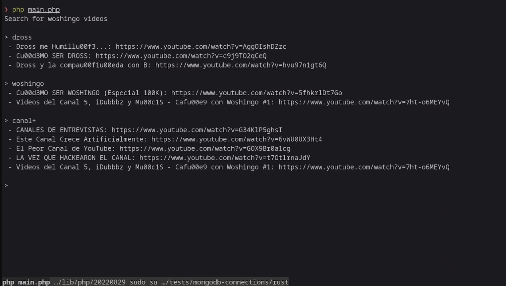

<!-- markdownlint-disable MD033 -->
# MongoDB with PHP


This repo shows how to connect to MongoDB using the official PHP driver.

**Resources used:**

- MongoDB PHP driver guide: <https://www.mongodb.com/docs/drivers/php/>
- Official MongoDB PHP library: <https://www.mongodb.com/docs/php-library/current/tutorial/install-php-library/>
- Official PHP package documentation: <https://www.php.net/mongodb>
- PHP MongoDB official course: <https://learn.mongodb.com/courses/connecting-to-mongodb-in-php>

---

## Getting started with MongoDB and PHP

As said in the PHP guide, the MongoDB PHP driver basically consists of two
components:

- The [extension](https://github.com/mongodb/mongo-php-driver), with a low-level
  API that integrates PHP with the `libmongoc` and `libbson` C drivers.

- The [library](https://www.mongodb.com/docs/php-library/current/), with a
  high-level API made on top of the extension.

The library is very straighforward and simple to use, however is easy to
write insecure code that may crash at runtime, since there is no type
validation nor code completition. That's why using a framework or another
library on top of this is highly recommended.

---

## Running the code

First install the necessary libraries for the MongoDB extension following
[this guide](https://www.mongodb.com/docs/php-library/current/tutorial/install-php-library/).

Then install the dependencies with composer:

```bash
# The official library
composer require mongodb/mongodb
# dotenv utility
composer require vlucas/phpdotenv
```

The [`vlucas/phpdotenv`](https://github.com/vlucas/phpdotenv) package is used for safely storing the MONGO_URI
connection string along with the database name and collection.

## About the data

The `sample_woshingo` database queried here contains the complete list of
videos of the Mexican youtuber [Woshingo](https://www.youtube.com/@Woshingo), scrapped using [`yt-dlp`](https://github.com/yt-dlp/yt-dlp).

## Results

The example consists on a basic video search.

To achieve this, first we setup a [text index](https://www.mongodb.com/docs/manual/core/index-text/)
for the collection. The following index will search strings in the `title`
property (the YouTube video title) and sort ascending the results by its
`view_count`.

```php
// Remove previous indexes
$collection->dropIndexes();

// https://www.mongodb.com/docs/manual/core/index-compound/
$compound_index = ['title' => 'text', 'view_count' => 1];
$collection->createIndex($compound_index);
```

Now we can easily filter query results:

```php
$filter = [ '$text' => [ '$search' => $input ] ];
$result = $collection->find($filter);
```

[](./demo.mp4)

> Click to see the video 🍃
