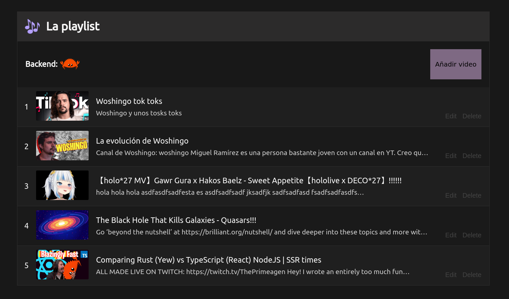

<!-- markdownlint-disable MD033 -->
# MongoDB with Rust

This repo shows how to connect to MongoDB using the official Rust crate.

Some of the code here was intentionally made overcomplicated for learning purposes.


Resources used:

- Official guide from MongoDB: <https://www.mongodb.com/docs/drivers/rust/>
- Crate documentation: <https://docs.rs/mongodb/latest/mongodb/>
- The Rust driver manual: <https://mongodb.github.io/mongo-rust-driver/manual/>

---

## About the data

The `sample_woshingo` database queried here contains the complete list of
videos of the Mexican youtuber [Woshingo](https://www.youtube.com/@Woshingo), scrapped using [`yt-dlp`](https://github.com/yt-dlp/yt-dlp).

## About the crates

```toml
[dependencies]
# The official MongoDB Rust driver
mongodb = "2.5.0"
# For supporting async DB operations
tokio = "1.28.2"
# For data serialization and deserialization within Rust structs
serde = { version = "1.0.163", features = ["derive"] }
# Utilities for handling futures
futures = "0.3.28"
```

## Running the code

First you will need a running MongoDB cluster. You can use a local instance or
preferably deploy a free tier cluster in the cloud using MongoDB Atlas.

Then, you need to create a `.env` file with your connection string:

```sh
# The MongoDB connection string
MONGO_URI=mongodb+srv://<username>:<password>@<cluster-url>
```

Finally, you can run the code with:

```sh
cargo run
```

## Results



## Next steps

There are some interesting features that can be implemented usign this codebase, like:

- HTTP API endpoints using Artix, Rocket or Warp.
- Results pagination instead of showing the raw full list.
- A frontend using Yew or other web frameworks.
