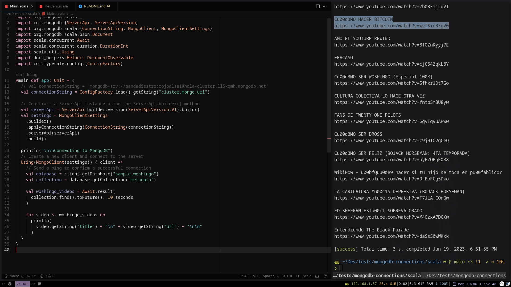

<!-- markdownlint-disable MD033 -->
<!-- markdownlint-disable MD041 -->
<span> </span>

<span> </span>

# MongoDB with Scala


This repo shows how to connect an query data from MongoDB using the official
Scala driver.

Note that the original Scala driver [has been deprecated](https://github.com/mongodb/mongo-scala-driver)
and moved to the [MongoDB Java driver](https://github.com/mongodb/mongo-java-driver)
along with the Kotlin driver.

Resources used:

- A tour of Scala: <https://docs.scala-lang.org/tour/tour-of-scala.html>
- Official guide from MongoDB: <https://www.mongodb.com/docs/drivers/scala/>
- Scala vs Java: <https://redwerk.com/blog/10-differences-between-scala-and-java/>
- The Rust driver manual: <https://mongodb.github.io/mongo-rust-driver/manual/>

> **Note**
> The man at the right is Woshingo, a Mexican youtuber. He's there because
> we needed to query data, and we had a json with all his YouTube videos at hand.

---

## About the code

Scala is an OOP + FP (functional programming) language built with readibility
and reliability in mind.

It is statically typed but "feels dynamic" thanks to its "very expressive type
system". It runs under the JVM and the browser. Scala can seamlessly integrate
with existing Java codebases.

This was my first time using Scala and I want to share some of my thoughts about
it:

- **The "21st century" thing**: Scala is often presented as a _write less, do
more_ version and modern replacement for writing JVM code "in a functional way".
They show meaningless code snippets like lists and maps and say "look how
concise and readable it is compared to Java", and while true, that's not the
point. Scala is a whole new functional programming language by itself, not only
with different syntax, but with different semantics and design, and is this new
way of thinking about your program what will make you _write less and do more_,
and not the syntax sugar.

- **Hard transition**: my first impression was that Scala is easy to read
and write. I used some "functional" paradigms in the past, or well, I thought I
did, but then you face concepts like _typeclasses_, _higher kinded types_,
_implicit parameters_, _monads_, _functors_, _applicatives_, _monoids_, etc.
you realize that you don't know anything about real functional programming.

- **The documentation**: I needed to spend almost two hours to figure out "the
proper way" to load environment variables, and I'm not sure if I ended up
doing it correctly.

## Running the code

First you will need a running MongoDB cluster. You can use a local instance or
preferably deploy a free tier cluster in the cloud using
[MongoDB Atlas](https://www.mongodb.com/atlas/database).

It's recommended to install Scala using `coursier`, an Scala artifact fetching
tool (think artifacts as reusable code, say packages).
[This guide](https://www.scala-lang.org/download/) will help you. If you don't
have a JVM platform, this will install one for you.

```sh
# For GNU/Linux
curl -fL https://github.com/coursier/coursier/releases/latest/download/cs-x86_64-pc-linux.gz | gzip -d > cs && chmod +x cs && ./cs setup

# For macOS
brew install coursier/formulas/coursier && cs setup
```

After cloning the repo, create a `.env` file with the following:

```sh
export MONGO_URI="<YOUR_CONNECTION_STRING>"
export DB_NAME="<YOUR_DATABASE_NAME>"
export DB_COLLECTION="<DB_COLLECTION_NAME>"
```

The [application.conf](./src/main/resources/application.conf) file will load
its values from the environemnt variables, and will fallback to the defaults
if not defined.

```sh
# Load the environment variables
source .env

# Run the project
# sbt is de facto build tool for Scala
sbt run
```

## Results



> Woshingo videos printed on the console
