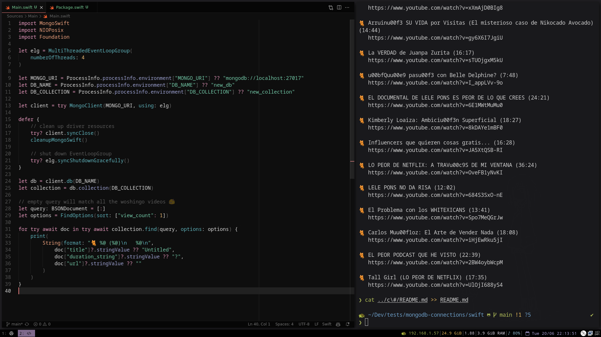

<!-- markdownlint-disable MD033 -->
# MongoDB with Swift


This repo shows how to connect to MongoDB using the official Swift driver.

Swift was a tough one, the initial setup was hard, it lacks of beginner friendly
installation guides. However, once installed, it felt like any other library,
but with a little bit more of control.

Resources used:

- Official Swift driver documentation: <https://www.mongodb.com/docs/drivers/swift/>
- Swift + MongoDB examples: <https://github.com/mongodb/mongo-swift-driver/tree/main/Examples>
- Building a Command Line Tool with Swift and MongoDB: <https://www.youtube.com/watch?v=cHB8hzUSCpE>

---

## About the data

The `sample_woshingo` database queried here contains the complete list of
videos of the Mexican youtuber [Woshingo](https://www.youtube.com/@Woshingo), scrapped using [`yt-dlp`](https://github.com/yt-dlp/yt-dlp).

## About the code

Every Swift project needs to have a `Package.swift` file. There is where we
need to define the mongo driver as a dependency.

The Swift driver also comes with a synchronous flavor, but is recommended
to use the async version.

```swift
dependencies: [
    .package(
        url: "https://github.com/mongodb/mongo-swift-driver",
        .upToNextMajor(from: "1.3.1")
    )
],
targets: [
    .target(name: "Main", dependencies: ["MongoSwift"]),
]
```

First we define a block of code that will run when the program exits, this
is mainly for cleanup the `libmongoc` resources.

```swift
defer {
    // clean up driver resources
    try? client.syncClose()
    cleanupMongoSwift()

    // shut down EventLoopGroup
    try? elg.syncShutdownGracefully()
}
```

With this library you need to think async.
Here is the code needed to print a whole collection:

```swift
let db = client.db(DB_NAME)
let collection = db.collection(DB_COLLECTION)

// empty query will match all the woshingo videos 🥳
let query: BSONDocument = [:]
let options = FindOptions(sort: ["view_count": 1])

for try await doc in try await collection.find(query, options: options) {
    print(
        String(format: "🐈 %@ (%@)\n   %@\n",
            doc["title"]?.stringValue ?? "Untitled",
            doc["duration_string"]?.stringValue ?? "?",
            doc["url"]?.stringValue ?? ""
        )
    )
}
```

## Running the code

First you will need a running MongoDB cluster. You can use a local instance or
preferably deploy a free tier cluster in the cloud using MongoDB Atlas.

Now install Swift (this is the rough part). Check out
[this guide](https://www.swift.org/download/).

After cloning the repo, create a `.env` file with your connection string:

```sh
export MONGO_URI="mongodb+srv://<username>:<password>@<cluster-url>"
export DB_NAME="sample_woshingo"
export DB_COLLECTION="metadata"
```

Now build the dependencies to link their binaries to Swift:

```sh
swift build
```

Finally, you can run the code with:

```sh
# Load your env variables first
source .env
swift run
```

## Results

Here we print the full list of Woshingo videos, picking only the properties that interest us.


