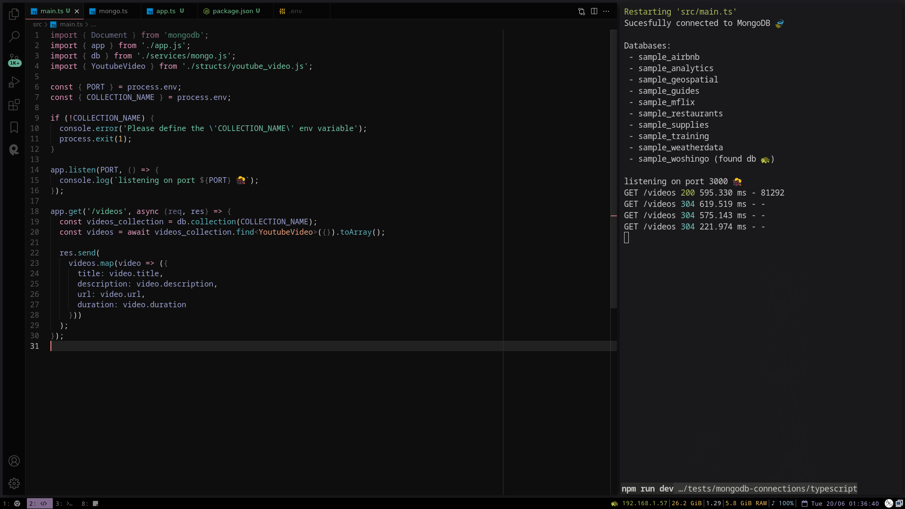
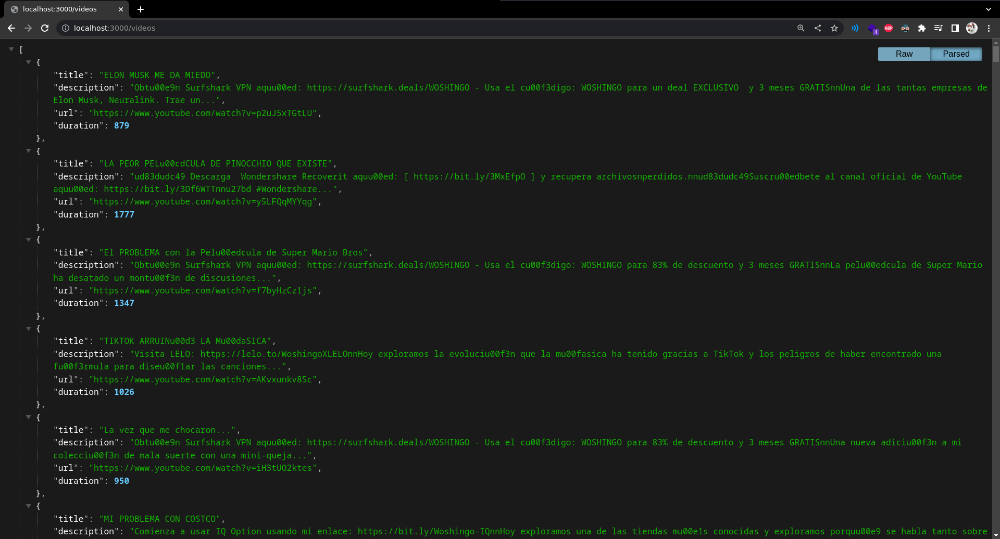

<!-- markdownlint-disable MD033 -->
# MongoDB with Typescript


This repo shows how to connect to MongoDB using the official Typescript library.

The `mongodb` npm package is alrady built with typescript support, so no
additional work was required.

Resources used:

- Official guide from MongoDB: <https://www.mongodb.com/docs/drivers/node>
- npm package: <https://www.npmjs.com/package/mongodb>
- The API Docs: <https://mongodb.github.io/node-mongodb-native>

---

## About the data

The `sample_woshingo` database queried here contains the complete list of
videos of the Mexican youtuber [Woshingo](https://www.youtube.com/@Woshingo),
scrapped using [`yt-dlp`](https://github.com/yt-dlp/yt-dlp).

## About the dependencies

We used [`tsx`](https://github.com/esbuild-kit/tsx) for the transpile-on-save
functionality, and the official `ŧypescript` package for building for
production.

Only `mongodb` and `express` were required for the actual database and endpoints
setup respectively. `morgan` was used to log the incoming requests.

```json
"devDependencies": {
    "@types/express": "4.17.17",
    "tsx": "3.12.7",
    "typescript": "5.1.3"
},
"dependencies": {
    "@types/morgan": "1.9.4",
    "dotenv": "16.3.1",
    "express": "4.18.2",
    "mongodb": "5.6.0",
    "morgan": "1.10.0"
}
```

## Running the code

First you will need a running MongoDB cluster. You can use a local instance or
preferably deploy a free tier cluster in the cloud using MongoDB Atlas.

A recent version of Node.js is required,
[download it here](https://nodejs.org/en/download).

After cloning the repo, create a `.env` file with the following:

```sh
PORT=3000
MONGO_URI="mongo://localhost:27017"
DB_NAME="sample_woshingo"
COLLECTION_NAME="metadata"
```

Finally, install the packages and run the code with:

```sh
npm install

# For development
npm run dev

# For building and running
npm run build && npm run start
```

## Results

Terminal output:



Browser response:



## Next steps

There are some interesting features that can be implemented usign this codebase, like:

- HTTP API CRUD endpoints.
- A trpc server or GraphQL endpoints to query the data.
- A frontend to visualize the results.
